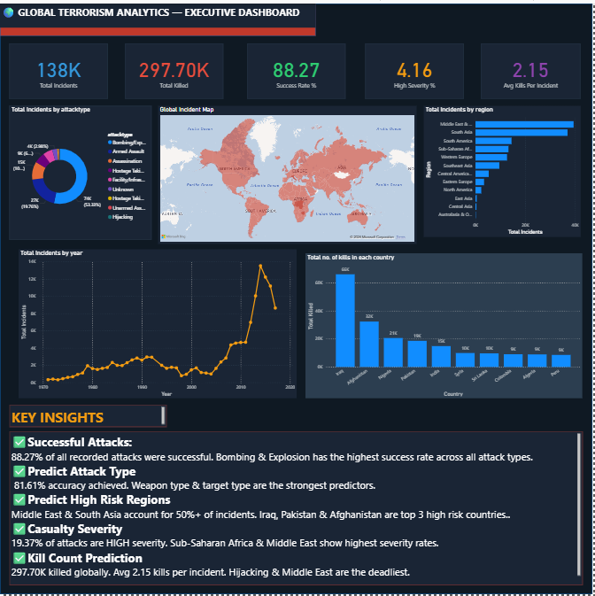
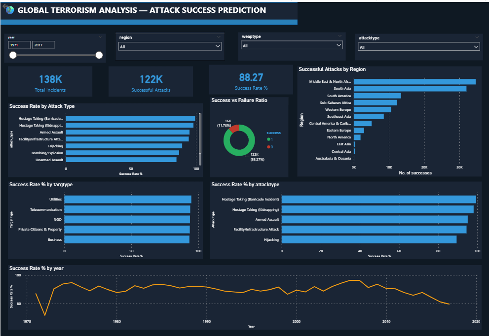
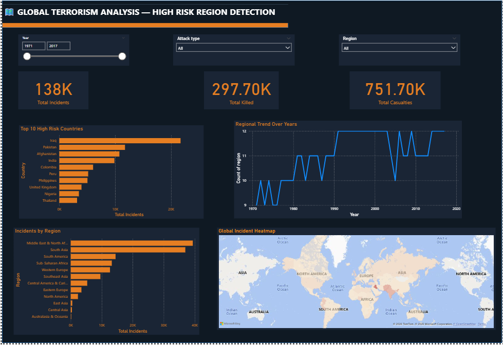
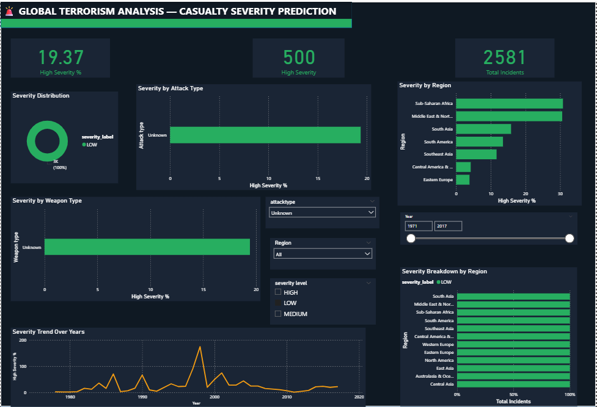
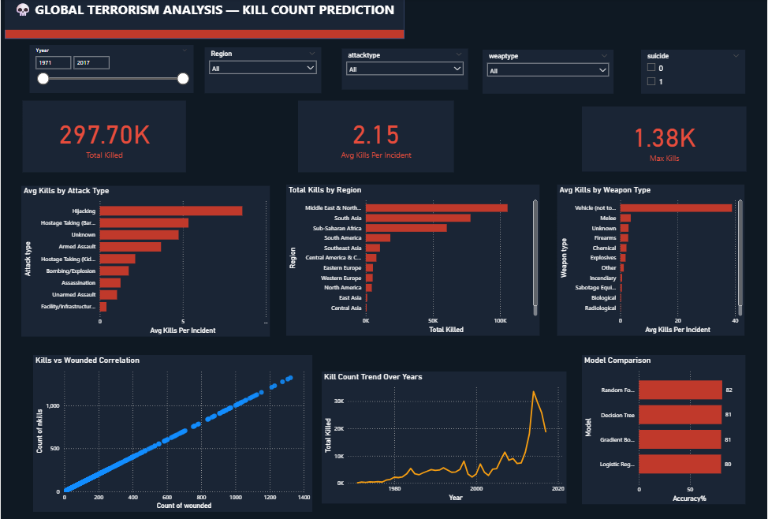

# 🌍 Global Terrorism — ML & Power BI Dashboard

---

## 📌 What is this Project About?
This project builds **Machine Learning models** to predict the type of terrorist attack and creates an interactive **Power BI Dashboard** to visualize global terrorism patterns across 5 objectives.

---

## 📊 About the Dataset
| Feature | Details |
|---|---|
| 📁 Source | Global Terrorism Database (GTD) |
| 📝 Total Records | 180,000+ incidents |
| 📅 Time Period | 1970 — 2017 |
| 🌍 Countries Covered | 200+ countries |

📥 **Download Dataset:** [Click Here](https://drive.google.com/file/d/1Vk17xK70g0wij_9xXcrEiXspUmoGRI0C/view?usp=sharing)

---

## 🎯 Project Objectives

| # | Objective | Person | 
|---|---|---|---|
| 01 | Predict Attack Success | Mayur | 
| 02 | Predict Attack Type | Deanne |
| 03 | Identify High Risk Regions | Team |
| 04 | Predict Casualty Severity | Anjali | 
| 05 | Predict Kill Count | Saiprakash | 

---

## 🤖 ML Approach (Objective 2 — Attack Type Prediction)

### Features Used
| Feature | Description |
|---|---|
| `country_txt` | Country of attack |
| `targtype1_txt` | Type of target |
| `weaptype1_txt` | Type of weapon used |

### Target Variable
attacktype1_txt — Type of attack
(Bombing, Armed Assault, Assassination etc.)
### Models Used & Results
| Model | Accuracy |
|---|---|
| 🏆 Random Forest | 81.61% |
| Decision Tree | 81.10% |
| Gradient Boosting | 80.53% |
| Logistic Regression | 80.48% |

### Key Finding
Random Forest is the preferred model due to better generalization and reduced overfitting. Weapon type & target type are the strongest predictors.

---

## 📸 Power BI Dashboard Screenshots

### 🌍 Executive Dashboard

### ✅ Attack Success Prediction

### ⚔️ Attack Type Prediction

### 🗺️ High Risk Region Detection

### 🚨 Casualty Severity Prediction

### 💀 Kill Count Prediction

---

## 💡 Key Insights
✅ 88.27% of all recorded attacks were successful
⚔️ Random Forest achieved 81.61% accuracy in predicting attack type
🗺️ Middle East & South Asia account for 50%+ of all incidents
🚨 19.37% of attacks classified as HIGH severity
💀 297.70K killed globally — Avg 2.15 kills per incident
📈 Peak terrorism activity recorded around 2014
🇮🇶 Iraq, Pakistan & Afghanistan are top 3 high risk countries
---

## 📁 Repository Structure
Global-Terrorism-ML-Dashboard/
│
├── 📓 Supervised_ML.ipynb
│      ML notebook with all models and evaluation
│
├── 📊 Gtd.pbix
│      Complete Power BI dashboard file
│
├── 📸 dashboard_overview.png
├── 📸 attack_success.png
├── 📸 attack_type.png
├── 📸 high_risk_regions.png
├── 📸 casualty_severity.png
├── 📸 kill_count.png
│
├── 📄 model_comparison.csv
├── 📄 feature_importance.csv
├── 📄 actual_vs_predicted.csv
├── 📄 attack_distribution.csv
│
└── 📄 README.md
---

## 🛠️ Tools & Technologies Used

| Tool | Purpose |
|---|---|
| 🐍 Python 3.12 | Programming language |
| 🤖 Scikit-Learn | ML model building |
| ⚡ XGBoost | Gradient boosting model |
| 🐼 Pandas | Data manipulation |
| 📊 Power BI | Dashboard & visualization |
| 📓 Google Colab | ML development environment |

---

## 🚀 How to Run ML Notebook

1. Open **Google Colab**
2. Upload `Supervised_ML.ipynb`
3. Upload GTD dataset
4. Click **Runtime → Run All**

## 📊 How to Open Dashboard

1. Download `Gtd.pbix`
2. Open with **Power BI Desktop**
3. Explore all 6 pages

---

## 👥 Full Project Team

| Member | Objective |
|---|---|
| Mayur | Predict Attack Success |
| Deanne | Predict Attack Type |
| Anjali | Predict Casualty Severity |
| Saiprakash | Predict Kill Count |
| Team | Identify High Risk Regions |

---

## 👩‍💻 About the Author
**Deanne Anthony**
- 🎯 Objective: Predict Type of Terrorist Attack
- 📊 Responsibilities: ML Model Building + Power BI Dashboard

---

## 🔗 Related Links
- 📊 [EDA Repository](https://github.com/deanneanthony/Global-Terrorism-EDA)
- 📁 [Power BI Dashboard](https://drive.google.com/file/d/1Vk17xK70g0wij_9xXcrEiXspUmoGRI0C/view?usp=drive_link)
- 🗄️ [Dataset Source](https://drive.google.com/file/d/1qaQjguvOtDurRYRHsa3xxThH-PuIuYvE/view?usp=drive_link)

---
⭐ If you found this project useful please consider giving it a star!
